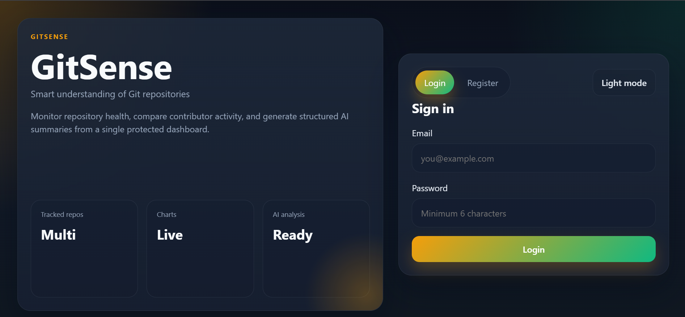
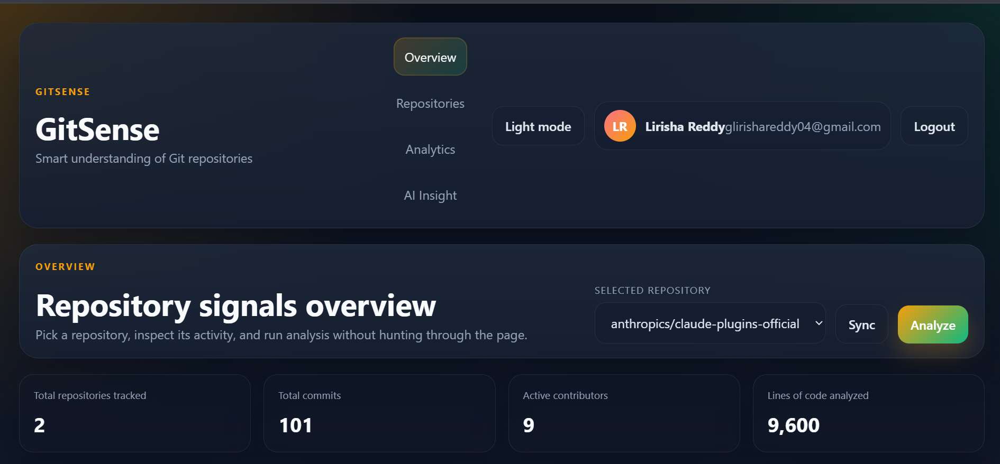
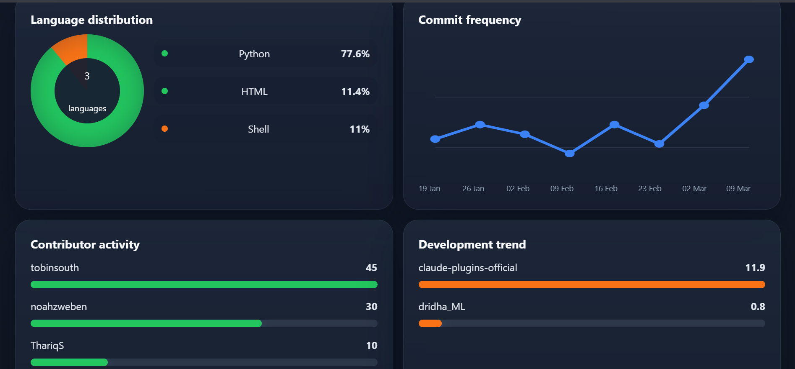
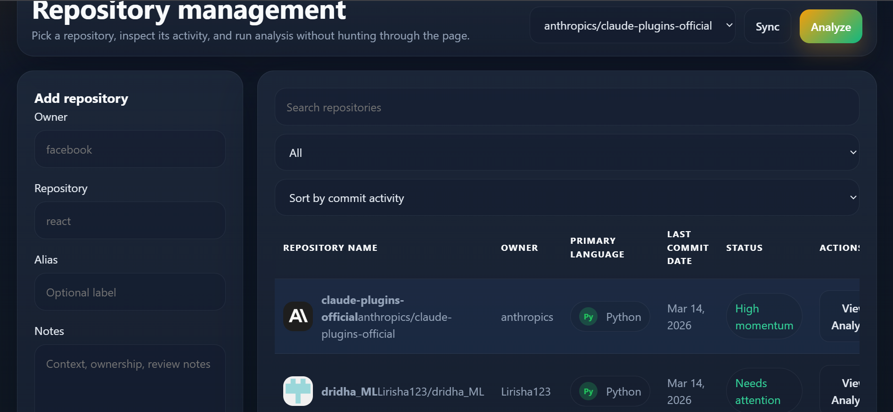
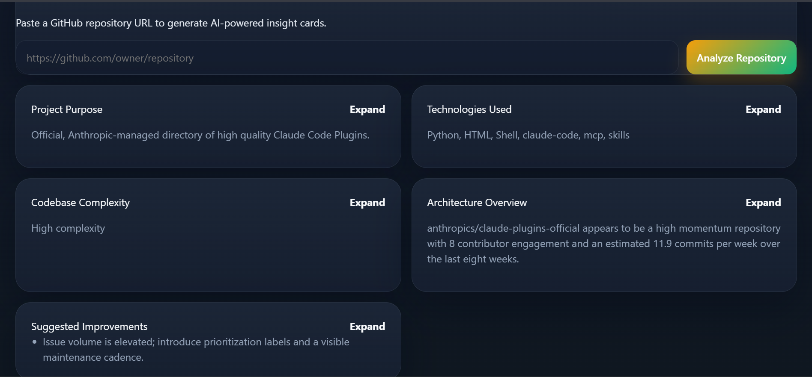

# 🚀 GitSense — AI-Powered GitHub Repository Insight Dashboard

> Smart understanding of Git repositories with analytics and AI-driven codebase insights.

GitSense is a full-stack developer intelligence platform that enables developers to **track, analyze, and understand GitHub repositories through interactive analytics and AI-powered codebase insights**.

The platform integrates GitHub repository data with **visual dashboards, repository analytics, and AI analysis** to help developers quickly understand project health, contributor activity, development trends, and repository architecture.

By combining **GitHub API integration, real-time analytics, CRUD-based repository management, and AI-generated codebase insights**, GitSense provides a centralized system for monitoring and evaluating software projects.

---

# 🌐 Live Demo

🔗 **Project Link**

https://git-sense-bay.vercel.app/login

---

# ✨ Key Features

## 📊 Repository Analytics Dashboard

Track and visualize GitHub repository activity through an interactive dashboard.

Features include:

- Commit frequency trends
- Contributor activity analysis
- Language distribution charts
- Development momentum tracking
- Multi-repository monitoring

---

## 🤖 AI Codebase Insight Engine

GitSense integrates an **AI-powered repository analysis system** that generates structured insights about GitHub repositories.

When a user clicks **Analyze Repository**, the platform generates:

- Project purpose detection
- Technologies used
- Codebase complexity analysis
- Architecture overview
- Suggested improvements

Example AI insight:

> "This repository appears to be a Python-based project with supporting HTML and Shell scripts. The project demonstrates active contributor engagement and consistent development momentum."

This allows developers to **quickly understand unfamiliar repositories without manually exploring the entire codebase.**

---

## 🗂 Repository Management (CRUD)

The platform supports full **CRUD operations** for repository tracking.

| Operation | Description |
|-----------|-------------|
| Create | Add GitHub repositories to track |
| Read | View analytics and insights |
| Update | Modify repository labels and notes |
| Delete | Remove repositories from the dashboard |

---

## 📈 Interactive Data Visualization

GitSense transforms repository data into meaningful visual insights:

- Commit frequency graphs
- Language distribution charts
- Contributor activity indicators
- Development trend analysis

---

## 🔐 Authentication System

The platform includes secure authentication features:

- User registration
- Login system
- Personalized repository dashboards

---

# 🧠 Novelty of the Project

GitSense introduces **AI-assisted repository understanding**, extending beyond traditional repository viewers.

### Key innovations include:

- Automated repository summarization
- AI-generated architecture insights
- Development momentum detection
- Codebase complexity evaluation
- Repository health analysis

These capabilities allow developers to **understand unfamiliar repositories within seconds**.

---

---

# ⚙️ Tech Stack

### Frontend
- React
- Interactive Dashboard UI
- Data Visualization Components

### Backend
- Spring Boot
- Maven

### Database
- MySQL
- Aiven Cloud Database

### APIs
- GitHub REST API

### Deployment
- Vercel

---

# 📸 Screenshots

## Login Page

---

## Dashboard Overview

---

## Repository Analytics

---

## Repository Management

---

## AI Codebase Insight

---

# 📊 Example Repository Signals

GitSense analyzes repository activity signals such as:

| Metric | Example |
|------|------|
| Tracked Repositories | 2 |
| Total Commits | 101 |
| Active Contributors | 9 |
| Lines of Code Analyzed | 9,600 |

These insights help developers **evaluate repository activity and collaboration patterns.**

---

# 👩‍💻 Author

**Lirisha Reddy**
Interested in AI-powered developer tools and intelligent analytics systems.

---

# ⭐ Project Vision

GitSense aims to evolve into a **developer intelligence platform** that helps engineers:

- Understand unfamiliar codebases faster
- Monitor repository health
- Analyze development patterns
- Make data-driven decisions for software projects
